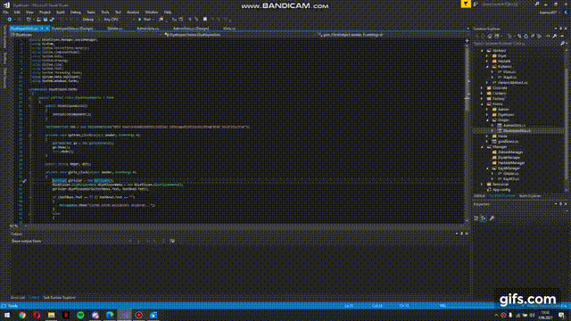

<h1>Stock Exchange Project [Software Construction Course Project] </h1>

## Project Description:
>Performing the user stories given for the Final project of making software under certain conditions. 
> Technologies We Use:
> <li> Windows Form </li>  
> <li> MSSQL </li>

## Necessary Tools

<ul>
  <li><a href="https://visualstudio.microsoft.com/tr/downloads/">Visual Studio</a></li>
  <li><a href="https://www.microsoft.com/tr-tr/sql-server/sql-server-downloads">Microsoft Sql Server Management Studio</a></li>
</ul>

## Download The Project
```
$ git clone https://github.com/muratagyz/Exchange
```

## Scrum Table Image
<br /><br />
<a href="https://github.com/users/muratagyz/projects/1"><b>Scrum Table (English)</b></a>

## Application Lecture Video
<br>[](https://www.youtube.com/watch?v=cgQsxzdSdwM)


## Contributors
<table>
  <tr>
    <td align="center"><a href="https://github.com/kaanzzdemir"><br /><sub><b>Kaan ÖZDEMİR</b></sub></a></td>
    <td align="center"><a href="https://github.com/muratagyz"><br /><sub><b>Murat AĞYÜZ</b></sub></a</td>
  </tr>
  </table>
